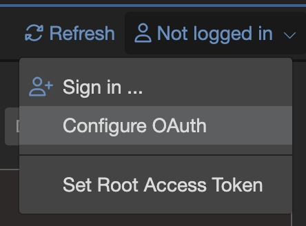
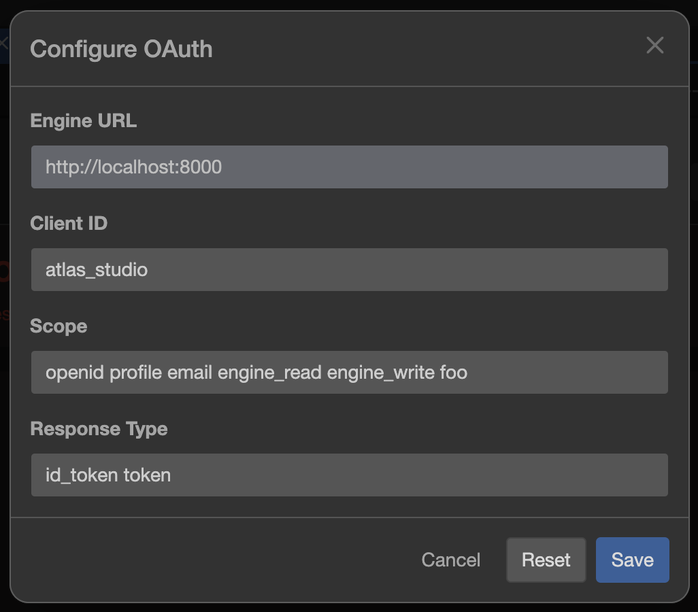
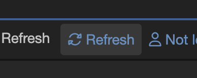

# Minimales 5Minds ProcessCube Setup mit Engine und Authority

## How to run

```shell
docker compose up
```

## How to test

1. Im Studio mit der Engine auf `localhost:8000` verbinden.
2. Mit dem Benutzer `admin` einloggen (Passwort: `admin`).
3. Das in `processes` befindliche BPMN Model öffnen und deployen. In diesem Prozess befindet sich eine Lane namens `bar`.
4. Ausloggen.
5. Im Studio beim Login-Dropdown `Configure OAuth` auswählen, den Scope `foo` hinzufügen.
   Dieser Scope beinhaltet den Claim `bar`.

   

   

6. Mit dem Benutzer `user` einloggen (Passwort: `user`).
   Dieser User hat den Scope `foo` mit dem Claim `bar`. Siehe [hier](./.processcube/authority/upeSeedingData.json#L15).
7. Ggf. "Process Models" refreshen.

   

8. Der Benutzer sollte das zuvor deployte Prozessmodel sehen können.
